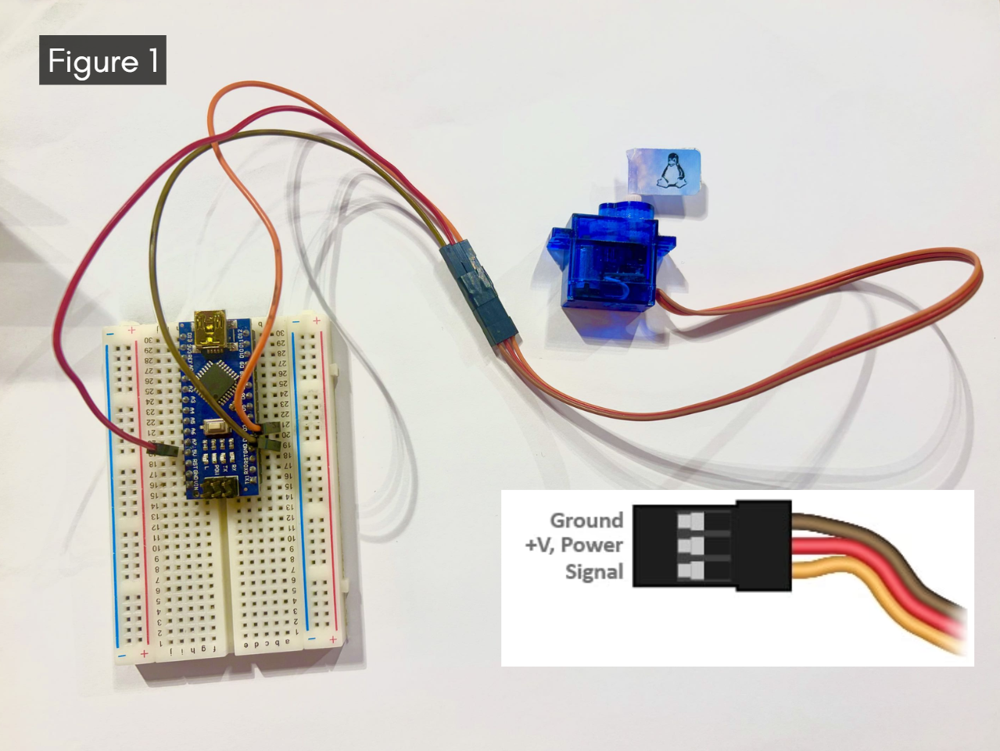
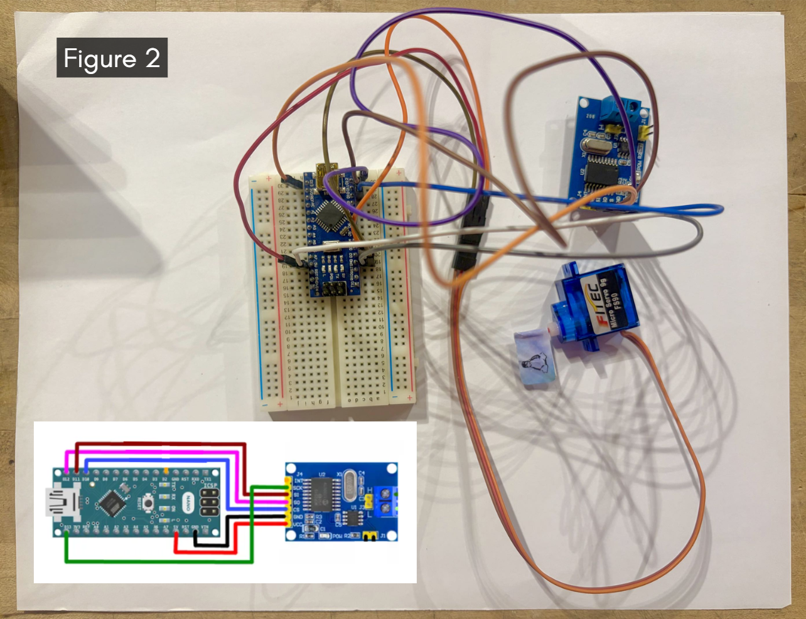
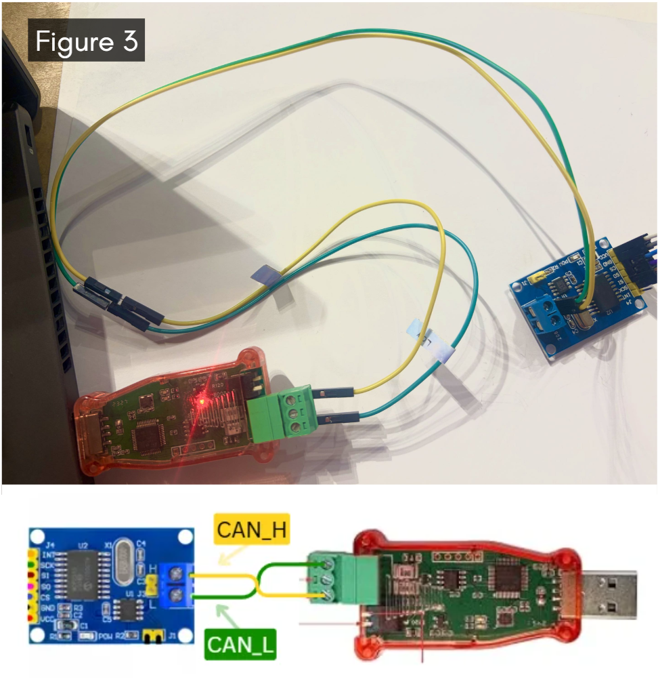
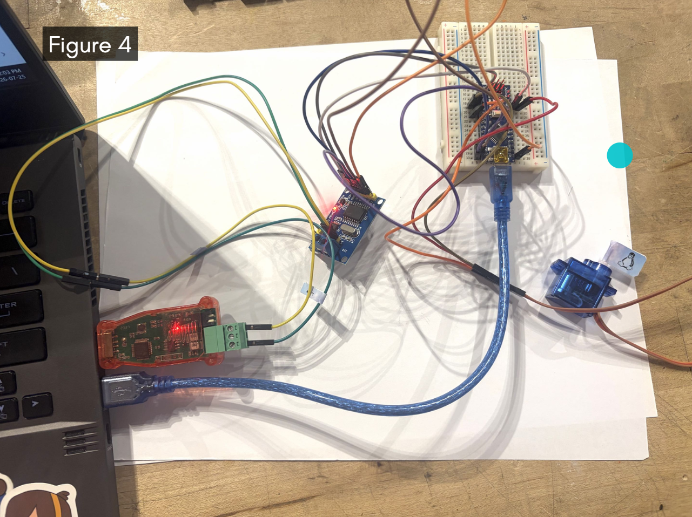
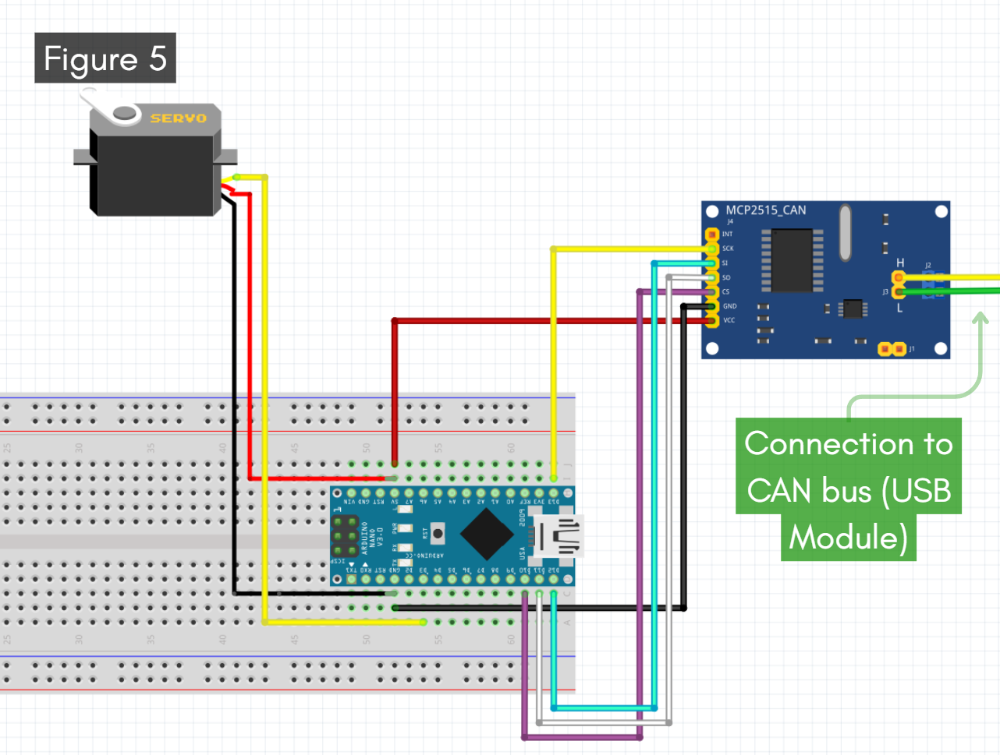

# **Tutorial 1: Servo Spin Test**

This is a tutorial on how to run a functional test using the \`Ares-CAN\` library. The test script includes calls to functions and relevant examples on how the code is used.

Understanding how this tutorial works will be helpful to understanding how to use various functions from the library.

### **Materials**

* Arduino Nano  
* MCP2515 CAN Module  
* USB CAN Connector  
* Any three pin servo  
* Jumper Wires

### **Hardware Setup**

For the purpose of this tutorial, we will be connecting an Arduino Nano to a Python Environment by hooking up an MCP2515 CAN module between them. This CAN connection will then be used to communicate with and spin a basic servo motor. 

#### **Hardware Connection Steps** 

1. As shown in Figure 1, the SER0043 model servo is to be connected to the Arduino Nano’s pin \#3 through its “signal” cable. 

   The “ground” and “power” cables should be connected to the Nano accordingly.   
     
   

2. The Nano is then connected to the MCP2515 with the following connections: 

| MCP\_2515 Pin  | Arduino Nano Pin |
| :---: | :---: |
| SCK | Pin 13 |
| SI | Pin 11 |
| SO | Pin 12 |
| CS | Pin 10  |
| VCC | 5V |
| GND  | GND |

   

   

   Figure 2 shows both what all the connections with the servo look like in real life, as well as a digital pinout diagram showing the MCP2515 connections to the Arduino Nano. 

3. The other end of the MCP2515 is linked to a Python environment. This could be an RPi, a Jetson, or in our case, a regular laptop running Python to simulate a microcontroller. 

   This can be done by wiring the CAN High and Low pins to the corresponding ports on the USB CAN connector, as follows. Refer to Figure 3 for reference:   
     
   
     
4. Plug the USB into your laptop. When you are done all the hardware setup steps, here is what your setup should look like:   
    
     
   

### **Running Instructions** 

All example tests are located in the \`functional\_tests\` directory in the repository. They are meant as sanity tests to confirm the functionality of the library as well as the hardware setup. Understanding how this tutorial works will be helpful to understanding how to use various functions from the library.

To run the test, follow these instructions:

1. Wire up the hardware setup, as detailed the Hardware Setup section.  
2. Follow the Installation Instructions page to install the library if you haven’t already done so.   
3. Upload the code in \`functional\_tests/servo\_spin\_test/servo\_spin\_test.ino\` to the Arduino Nano.   
4. Make sure you are in the \``` ares_can` `` (home) directory.  
5. Activate your Python environment. Create one if you do not have one, and make sure to include everything inside \`requirements.txt\` inside your virtual environment.  
   1. You can create a new virtual environment with the command \`python \-m venv .venv\`   
   2. Then run \`.venv\\Scripts\\activate\`  
   3. Lastly, install the required packages with the command \`python \-m pip install \-r requirements.txt\`  
6. Set up CAN by running \`source setup\_can.sh\` in the terminal.   
7. Run: \``` python -m functional_tests.servo_spin_test.servo_spin_test` ``in your terminal.   
8. Your servo motor should start spinning\! If it does not, it’s time to debug. 

